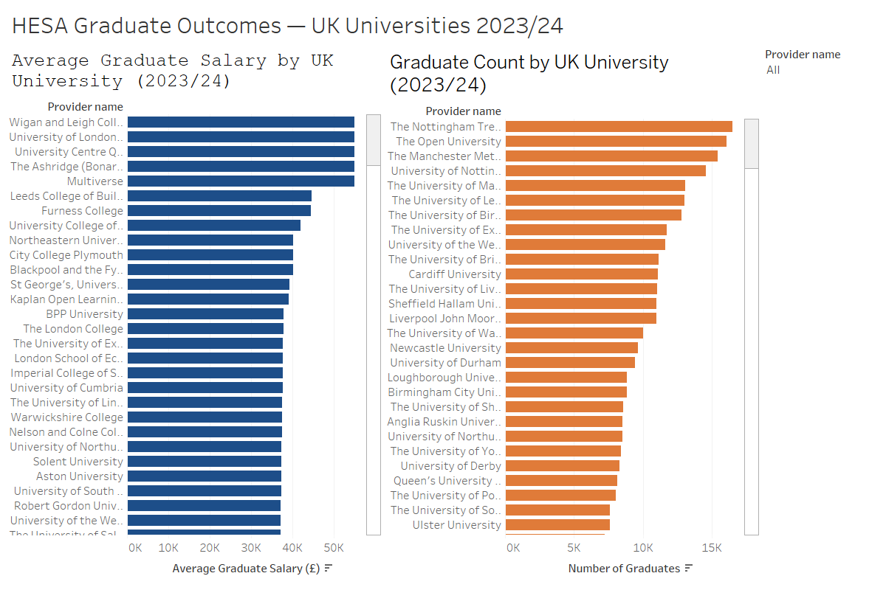

# 🎓 HESA Graduate Outcomes — Alteryx + Tableau Dashboard

**Author:** Ansh Chordiya · MSc Data Science & Analytics, Brunel University London  
**Stack:** Alteryx Designer · Tableau Public · HESA Open Data

---

## Overview

An end-to-end ETL pipeline and interactive dashboard analysing graduate salary outcomes across 239 UK universities, built using real open data from the Higher Education Statistics Agency (HESA).

Raw HESA data (166,980 rows) is processed through a 7-step Alteryx workflow — cleaning, transforming, and aggregating — before being visualised in an interactive Tableau Public dashboard showing average graduate salary and graduate headcount by provider.

---

## Live Dashboard

> 🔗 [View on Tableau Public](https://public.tableau.com/app/profile/ansh.chordiya/viz/Book1_17817150651720/HESAGraduateOutcomesUKUniversities202324))



---

## ETL Pipeline — Alteryx Workflow

The Alteryx workflow processes raw HESA data through 7 sequential tools:

```
Raw HESA CSV (166,980 rows)
        │
        ▼
┌─────────────────┐
│  1. Input Data  │  Loads table-26-2023-24.csv
└────────┬────────┘
         │
         ▼
┌─────────────────┐
│  2. Select      │  Keeps 4 columns: Provider name, Skill group,
│                 │  Salary band, Number
└────────┬────────┘
         │
         ▼
┌─────────────────┐
│  3. Filter      │  Removes Total rows, keeps Skill group = All,
│                 │  removes zero-count rows → 16,708 rows
└────────┬────────┘
         │
         ▼
┌─────────────────┐
│  4. Formula     │  Converts salary bands to numeric midpoints
│                 │  e.g. £30,000–£32,999 → 31500
└────────┬────────┘
         │
         ▼
┌─────────────────┐
│  5. Summarize   │  Aggregates to one row per university:
│                 │  Average salary + Total graduate count
└────────┬────────┘
         │
         ▼
┌─────────────────┐
│  6. Sort        │  Ranks universities highest salary first
└────────┬────────┘
         │
         ▼
┌─────────────────┐
│  7. Output Data │  Exports clean CSV → 239 rows × 3 columns
└─────────────────┘
```

---

## Dashboard Features

| Feature | Detail |
|---|---|
| **Chart 1** | Average graduate salary by UK university (blue) |
| **Chart 2** | Graduate headcount by UK university (orange) |
| **Search filter** | Type any university name to highlight across both charts |
| **Cross-filtering** | Click any bar to highlight that provider on both charts |
| **Tooltips** | Hover over any bar for exact figures |
| **Data** | 239 UK universities · 2023/24 academic year |

---

## Data Source

| Detail | Information |
|---|---|
| **Dataset** | HESA Table 26 — Graduate Outcomes by Salary Band |
| **Publisher** | Higher Education Statistics Agency (HESA) |
| **Year** | 2023/24 |
| **Licence** | Creative Commons Attribution 4.0 |
| **Download** | [hesa.ac.uk/data-and-analysis/graduates](https://www.hesa.ac.uk/data-and-analysis/graduates/outcomes) |

> **Note:** Salary figures are derived from HESA salary band midpoints (e.g. £30,000–£32,999 → £31,500). Graduate counts are rounded to the nearest 5 as per HESA disclosure policy.

---

## Repository Structure

```
hesa-graduate-outcomes-alteryx-tableau/
├── hesa_graduate_outcomes_workflow.yxmd   # Alteryx ETL workflow
├── hesa_graduate_outcomes_clean.csv       # Cleaned output (239 rows)
├── table-26-2023-24.csv                   # Raw HESA source data
├── hesa_dashboard_screenshot.png          # Dashboard preview
└── README.md
```

---

## Key Findings (2023/24)

- **166,980** raw records processed down to **239** provider-level summaries
- Salary bands converted to numeric midpoints across **14 salary brackets**
- Highest average graduate salary providers sit above **£50,000**
- Largest providers by graduate headcount exceed **15,000** graduates annually
- Significant variation in graduate outcomes across provider type and size

---

## How to Reproduce

**Alteryx Workflow:**
1. Download `table-26-2023-24.csv` from the HESA link above
2. Open `hesa_graduate_outcomes_workflow.yxmd` in Alteryx Designer
3. Update the Input Data file path to point to your downloaded CSV
4. Click Run — outputs `hesa_graduate_outcomes_clean.csv`

**Tableau Dashboard:**
1. Open Tableau Public Desktop
2. Connect to `hesa_graduate_outcomes_clean.csv`
3. Recreate sheets and dashboard as per the screenshot above

---

## Author

**Ansh Chordiya** · Brunel University London  
[anshtp2002@gmail.com](mailto:anshtp2002@gmail.com) ·
[LinkedIn](https://linkedin.com/in/anshchordiya) · 
[GitHub](https://github.com/anshchordiya2002)
